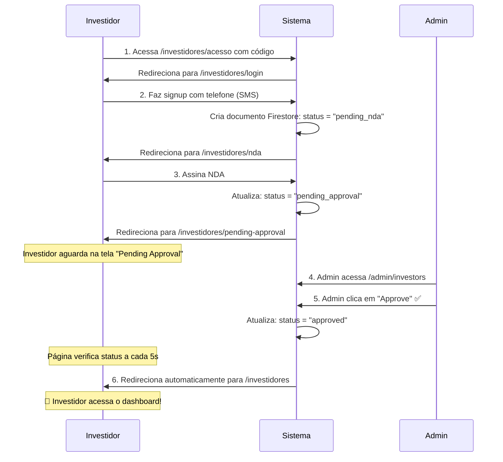

# 🔐 Admin Setup & Investor Approval Guide

## 📋 Índice
1. [Criar conta Admin no Firebase](#passo-1-criar-conta-admin-no-firebase)
2. [Adicionar Admin no Firestore](#passo-2-adicionar-admin-no-firestore)
3. [Fazer Login como Admin](#passo-3-fazer-login-como-admin)
4. [Aprovar Investidores](#passo-4-aprovar-investidores)
5. [Troubleshooting](#troubleshooting)

---

## 🚀 Passo 1: Criar conta Admin no Firebase

### 1.1 Acesse o Firebase Console
1. Vá para [Firebase Console](https://console.firebase.google.com/)
2. Selecione o projeto **`greencheck-app`**
3. No menu lateral, clique em **"Authentication"**

### 1.2 Criar usuário Email/Password
1. Na aba **"Users"**, clique em **"Add user"**
2. Preencha:
   - **Email**: `admin@greencheck.pt` (ou outro email que preferir)
   - **Password**: Escolha uma senha forte (mínimo 6 caracteres)
   - ✅ Marque **"Email verified"** (opcional, mas recomendado)
3. Clique em **"Add user"**
4. **📝 IMPORTANTE**: Copie o **UID** do usuário criado (ex: `aBc123XyZ456...`)

---

## 🗄️ Passo 2: Adicionar Admin no Firestore

Agora você precisa criar um documento na collection `admins` para marcar esse usuário como admin.

### Opção A: Via Firebase Console (Mais fácil)

1. No Firebase Console, vá em **"Firestore Database"** no menu lateral
2. Se não tiver banco de dados criado, clique em **"Create database"**
   - Escolha **"Start in production mode"** ou **"Test mode"** (test mode = sem regras de segurança)
   - Escolha região: **`europe-west1`** (mais próximo de Portugal)
3. Clique em **"Start collection"**
4. Preencha:
   - **Collection ID**: `admins`
   - Clique em **"Next"**
5. Preencha o **primeiro documento**:
   - **Document ID**: Cole aqui o **UID** do admin que você copiou no Passo 1.1 (ex: `aBc123XyZ456...`)
   - Adicione os seguintes **campos**:

   | Field | Type | Value |
   |-------|------|-------|
   | `email` | string | `admin@greencheck.pt` |
   | `name` | string | `Admin Greencheck` |
   | `role` | string | `admin` ✅ **IMPORTANTE** |
   | `createdAt` | timestamp | Clique no relógio e selecione "Now" |

6. Clique em **"Save"**

### Opção B: Via Script Node.js (Avançado)

Se preferir, pode criar um script rápido:

```javascript
// create-admin.js
const admin = require('firebase-admin');
const serviceAccount = require('./serviceAccountKey.json');

admin.initializeApp({
  credential: admin.credential.cert(serviceAccount)
});

const db = admin.firestore();

async function createAdmin() {
  // 1. Criar usuário no Firebase Auth
  const userRecord = await admin.auth().createUser({
    email: 'admin@greencheck.pt',
    password: 'YourStrongPassword123!',
    emailVerified: true
  });

  console.log('✅ User created with UID:', userRecord.uid);

  // 2. Adicionar documento no Firestore
  await db.collection('admins').doc(userRecord.uid).set({
    email: 'admin@greencheck.pt',
    name: 'Admin Greencheck',
    role: 'admin',
    createdAt: admin.firestore.FieldValue.serverTimestamp()
  });

  console.log('✅ Admin document created in Firestore');
  console.log('\n📧 Login credentials:');
  console.log('Email:', 'admin@greencheck.pt');
  console.log('Password:', 'YourStrongPassword123!');
}

createAdmin().then(() => process.exit(0));
```

---

## 🔑 Passo 3: Fazer Login como Admin

### 3.1 Acessar página de login admin
1. Abra o browser
2. Acesse: **`https://seu-dominio.replit.dev/admin/login`**
   - Ou localmente: **`http://localhost:5000/admin/login`**

### 3.2 Fazer login
1. Digite o **email**: `admin@greencheck.pt`
2. Digite a **password** que você criou
3. Clique em **"Sign In"**
4. ✅ Se tudo estiver correto, você será redirecionado para **`/admin/investors`**

### 3.3 Troubleshooting login

#### ❌ Erro: "Unauthorized. Admin access only."
**Causa**: O UID do usuário não existe na collection `admins` OU o campo `role` não está como `"admin"`.

**Solução**:
1. Vá no Firestore Console
2. Verifique se a collection `admins` existe
3. Verifique se tem um documento com o UID do usuário
4. Verifique se o campo `role` está **exatamente** como `"admin"` (lowercase, sem espaços)

#### ❌ Erro: "Invalid email or password"
**Causa**: Email ou senha incorretos.

**Solução**:
1. Vá no Firebase Console → Authentication
2. Clique no usuário admin
3. Clique em **"Reset password"** se necessário

---

## ✅ Passo 4: Aprovar Investidores

Agora que você está logado como admin, pode aprovar investidores!

### 4.1 Dashboard Admin

Na página **`/admin/investors`** você verá:

#### 📊 Cards de estatísticas no topo:
- **Total Investors**: Todos os investidores
- **Pending NDA**: Ainda não assinaram NDA
- **Pending Approval**: Assinaram NDA, aguardando aprovação ⚠️
- **Approved**: Já aprovados ✅
- **Rejected**: Rejeitados ❌

#### 🔍 Filtros:
Clique nos botões para filtrar:
- **All**: Mostrar todos
- **Pending NDA**: Apenas quem não assinou NDA
- **Pending Approval**: Apenas quem precisa de aprovação ⚠️
- **Approved**: Apenas aprovados
- **Rejected**: Apenas rejeitados

#### 📋 Tabela de investidores:
Mostra para cada investidor:
- Nome e cargo
- Empresa
- Email e telefone
- Status (badge colorido)
- Data de registro
- Ações (botões)

### 4.2 Aprovar um investidor

#### Método 1: Direto na tabela
1. Encontre o investidor com status **"Pending Approval"** 🟠
2. Clique no botão verde ✅ (ícone CheckCircle2)
3. O status mudará para **"Approved"** 🟢
4. O investidor agora pode acessar o portal!

#### Método 2: Via modal de detalhes
1. Clique no botão 👁️ (Eye) para ver detalhes do investidor
2. Um modal abrirá com:
   - Nome, empresa, cargo
   - Email, telefone
   - Data de registro
   - Data e IP de assinatura do NDA
3. Se o status for **"Pending Approval"**, verá 2 botões grandes:
   - **"Approve Access"** 🟢 → Clique aqui para aprovar
   - **"Reject"** 🔴 → Clique aqui para rejeitar
4. Após clicar, o modal fechará automaticamente

### 4.3 Rejeitar um investidor

1. Clique no botão vermelho ❌ (XCircle) na tabela
   - OU abra o modal de detalhes e clique em **"Reject"**
2. O status mudará para **"Rejected"** 🔴
3. O investidor **não poderá** acessar o portal

### 4.4 O que acontece após aprovar?

#### No banco de dados (Firestore):
```json
{
  "uid": "abc123...",
  "status": "approved",
  "approvedAt": "2025-10-10T15:30:00Z",
  "approvedBy": "admin-uid-here"
}
```

#### Para o investidor:
1. Se ele estiver na página **`/investidores/pending-approval`**:
   - A página verifica o status a cada 5 segundos
   - Quando detectar `"approved"`, redireciona automaticamente para **`/investidores`**
2. Se ele fizer login novamente:
   - Vai direto para **`/investidores`** (dashboard principal)

---

## 🔄 Fluxo completo: Do cadastro à aprovação



---

## 🛡️ Segurança: Firebase Security Rules

Para proteger o Firestore, adicione estas regras:

### No Firebase Console:
1. Vá em **Firestore Database** → **Rules**
2. Cole este código:

```javascript
rules_version = '2';
service cloud.firestore {
  match /databases/{database}/documents {
    
    // Investors collection
    match /investors/{investorUid} {
      // Permitir leitura/escrita apenas para o próprio investidor
      allow read, write: if request.auth != null && request.auth.uid == investorUid;
      
      // Permitir leitura para admins
      allow read: if request.auth != null && 
                     exists(/databases/$(database)/documents/admins/$(request.auth.uid)) &&
                     get(/databases/$(database)/documents/admins/$(request.auth.uid)).data.role == 'admin';
      
      // Permitir escrita (approve/reject) para admins
      allow write: if request.auth != null && 
                      exists(/databases/$(database)/documents/admins/$(request.auth.uid)) &&
                      get(/databases/$(database)/documents/admins/$(request.auth.uid)).data.role == 'admin';
    }
    
    // Admins collection
    match /admins/{adminUid} {
      // Apenas admins podem ler a collection admins
      allow read: if request.auth != null && 
                     exists(/databases/$(database)/documents/admins/$(request.auth.uid)) &&
                     get(/databases/$(database)/documents/admins/$(request.auth.uid)).data.role == 'admin';
      
      // Ninguém pode escrever via client-side (apenas via Admin SDK)
      allow write: if false;
    }
    
    // Negar tudo por padrão
    match /{document=**} {
      allow read, write: if false;
    }
  }
}
```

3. Clique em **"Publish"**

---

## 🧪 Testando o fluxo completo

### Teste 1: Criar investidor de teste

1. Abra uma aba anônima (Ctrl+Shift+N)
2. Acesse `/investidores/acesso`
3. Digite o código de acesso (ex: `GREENCHECK2025`)
4. Faça signup com um número de teste
5. Assine o NDA
6. Aguarde na tela "Pending Approval"

### Teste 2: Aprovar como admin

1. Em outra aba/janela normal, acesse `/admin/login`
2. Faça login como admin
3. Veja o investidor na lista com status **"Pending Approval"**
4. Clique em **"Approve"** ✅
5. Veja o status mudar para **"Approved"** 🟢

### Teste 3: Verificar redirecionamento automático

1. Volte na aba anônima (onde o investidor está esperando)
2. **Aguarde até 5 segundos**
3. A página deve redirecionar automaticamente para `/investidores`
4. O investidor agora vê o dashboard completo! 🎉

---

## 🐛 Troubleshooting

### ❌ "Firebase: Error (auth/user-not-found)" ao fazer login admin

**Causa**: Usuário não foi criado no Firebase Authentication.

**Solução**: Volte ao [Passo 1](#passo-1-criar-conta-admin-no-firebase) e crie o usuário.

---

### ❌ "Unauthorized. Admin access only." após login

**Causa**: Documento do admin não existe no Firestore ou `role` não está como `"admin"`.

**Solução**:
1. Vá no Firestore Console
2. Collection: `admins`
3. Verifique se tem documento com o UID do usuário
4. Verifique campo `role: "admin"` (exatamente assim, lowercase)

---

### ❌ Nenhum investidor aparece na lista admin

**Causa**: Nenhum investidor se cadastrou ainda OU erro nas regras de segurança.

**Solução**:
1. Cadastre um investidor de teste (veja [Teste 1](#teste-1-criar-investidor-de-teste))
2. Verifique Firestore Console → Collection `investors`
3. Se tiver investidores mas não aparecem, desabilite temporariamente as Security Rules:
   ```javascript
   rules_version = '2';
   service cloud.firestore {
     match /databases/{database}/documents {
       match /{document=**} {
         allow read, write: if true; // CUIDADO: apenas para debug!
       }
     }
   }
   ```

---

### ❌ Investidor não é redirecionado automaticamente após aprovação

**Causa**: Polling da página pode não estar funcionando.

**Solução**:
1. Peça ao investidor para **recarregar a página** (F5)
2. Ele será redirecionado manualmente
3. Verifique o console do browser (F12) por erros

---

## 📊 Monitoramento

### Firebase Usage Dashboard
1. Acesse Firebase Console → Usage & Billing
2. Monitore:
   - **Firestore reads**: Deve ser ~10-20 por minuto (polling)
   - **Authentication**: Cada login/signup conta
   - **SMS quota**: Gratuito = 10 SMS/dia

### Logs do Admin
Abra o console do browser (F12) quando estiver em `/admin/investors`:
```javascript
// Ver investidores carregados
console.log('Investors:', investors)

// Ver filtro ativo
console.log('Active filter:', activeFilter)

// Forçar reload dos investidores
location.reload()
```

---

## 🚀 Próximos passos

### Melhorias futuras:

1. **Email notifications**:
   - Enviar email ao investidor quando for aprovado
   - Firebase Cloud Functions + SendGrid/Mailgun

2. **Razão de rejeição**:
   - Campo de texto ao rejeitar
   - Mostrar razão ao investidor

3. **Múltiplos admins**:
   - Diferentes níveis: `super_admin`, `admin`, `moderator`

4. **Auditoria completa**:
   - Log de todas as ações admin em collection `admin_logs`

5. **Dashboard analytics**:
   - Gráficos de crescimento
   - Tempo médio de aprovação

---

## 📧 Suporte

**Dúvidas?** Entre em contato:
- Email: invest@greencheck.pt
- GitHub Issues: [link do repo]

---

## ✅ Checklist rápido

- [ ] Criei usuário admin no Firebase Authentication
- [ ] Copiei o UID do usuário
- [ ] Criei documento em `admins/{UID}` no Firestore
- [ ] Campo `role: "admin"` está correto
- [ ] Consigo fazer login em `/admin/login`
- [ ] Dashboard `/admin/investors` carrega
- [ ] Vejo lista de investidores (ou mensagem "No investors found")
- [ ] Consigo aprovar um investidor de teste
- [ ] Investidor é redirecionado automaticamente após aprovação

---

**Última atualização**: 2025-10-10  
**Versão**: 1.0


