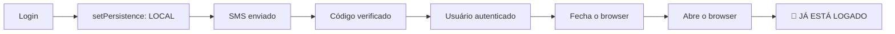
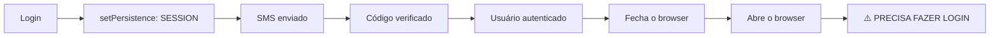

# 🔐 Firebase Authentication Persistence - "Keep Me Logged In"

## 📌 O que foi implementado

Foi adicionado um sistema de **"Keep me logged in"** (Manter conectado) na página de login dos investidores (`/investidores/login`) para:

1. ✅ **Evitar múltiplos logins via SMS** - Usuário não precisa fazer login toda vez
2. ✅ **Prevenir erro `auth/too-many-requests`** - Firebase limita tentativas de SMS
3. ✅ **Melhorar experiência do usuário** - Login automático quando retornar

---

## 🎯 Como funciona

### 1. Firebase Persistence Modes

O Firebase oferece 3 modos de persistência de autenticação:

| Modo | Duração | Quando usar |
|------|---------|-------------|
| `browserLocalPersistence` | **Permanente** (até logout manual) | ✅ "Keep me logged in" marcado |
| `browserSessionPersistence` | **Temporária** (fecha o browser = faz logout) | ⚠️ "Keep me logged in" desmarcado |
| `inMemoryPersistence` | **RAM apenas** (refresh = logout) | ❌ Não usado |

### 2. Implementação no código

#### **Estado do checkbox**
```typescript
const [rememberMe, setRememberMe] = useState(true) // Default true
```

#### **Configuração antes do login**
```typescript
const handleLoginSendCode = async (e: React.FormEvent) => {
  // ...
  
  // Configurar persistence baseado em "Remember Me"
  if (auth) {
    await setPersistence(
      auth, 
      rememberMe ? browserLocalPersistence : browserSessionPersistence
    )
  }
  
  // Enviar SMS...
}
```

#### **UI do checkbox**
```tsx
<label className="flex items-center gap-3 cursor-pointer group py-1">
  <input
    type="checkbox"
    checked={rememberMe}
    onChange={(e) => setRememberMe(e.target.checked)}
    className="w-5 h-5 rounded border-2 border-gray-300 checked:bg-[#5FA037]..."
  />
  <div className="flex flex-col">
    <span className="text-sm text-gray-700">Keep me logged in</span>
    <span className="text-xs text-gray-400">You won't need SMS code next time</span>
  </div>
</label>
```

---

## 🔄 Fluxo completo

### Cenário 1: "Keep me logged in" ✅ MARCADO (Padrão)



### Cenário 2: "Keep me logged in" ❌ DESMARCADO



---

## 🛡️ Mensagens de erro melhoradas

Adicionados tratamentos de erro específicos para:

```typescript
if (err.code === 'auth/too-many-requests') {
  setError('⏱️ Too many login attempts. Please wait 1 hour or contact support at invest@greencheck.io')
}

if (err.code === 'auth/quota-exceeded') {
  setError('📱 SMS quota exceeded today. Please try again tomorrow or contact support')
}
```

### Quando acontecem estes erros?

- **`auth/too-many-requests`**: Firebase bloqueia após ~10-15 tentativas de SMS em 1 hora do mesmo IP ou número
- **`auth/quota-exceeded`**: Projeto Firebase atingiu limite diário de SMS (gratuito = 10 SMS/dia)

---

## 🧪 Como testar

### Teste 1: "Keep me logged in" marcado ✅

1. Acesse `/investidores/login`
2. **Checkbox "Keep me logged in" deve estar marcado por padrão**
3. Faça login com SMS
4. Feche o browser completamente
5. Abra novamente e acesse `/investidores`
6. ✅ **Você deve entrar direto no dashboard sem pedir SMS**

### Teste 2: "Keep me logged in" desmarcado ❌

1. Acesse `/investidores/login`
2. **Desmarque o checkbox "Keep me logged in"**
3. Faça login com SMS
4. Feche o browser completamente
5. Abra novamente e acesse `/investidores`
6. ❌ **Você deve ser redirecionado para `/investidores/login`**

### Teste 3: Logout manual

1. Estando logado, execute no console do browser:
```javascript
firebase.auth().signOut()
```
2. ✅ **Deve fazer logout mesmo com "Keep me logged in" marcado**

---

## 🔧 Troubleshooting

### Problema: "Ainda pede SMS toda vez mesmo com checkbox marcado"

**Possíveis causas:**

1. ⚠️ **Cookies bloqueados** - Usuário bloqueou cookies third-party
   - Solução: Pedir usuário habilitar cookies

2. ⚠️ **Modo anônimo/privado** - Browser não persiste dados
   - Solução: Usar browser em modo normal

3. ⚠️ **Logout manual** - Alguém chamou `auth.signOut()`
   - Solução: Fazer login novamente

### Problema: "Erro auth/too-many-requests"

**Solução:**
1. ✅ Esperar 1 hora (cooldown do Firebase)
2. ✅ Usar outro número de telefone temporariamente
3. ✅ Contatar suporte em `invest@greencheck.io`

---

## 📊 Vantagens desta implementação

| Vantagem | Impacto |
|----------|---------|
| ✅ **Menos SMS enviados** | Economia de quota do Firebase |
| ✅ **Melhor UX** | Usuário não precisa fazer login toda vez |
| ✅ **Evita bloqueios** | Menos chance de `too-many-requests` |
| ✅ **Segurança mantida** | Token JWT expira em 1 hora, Firebase renova automaticamente |
| ✅ **Opção do usuário** | Checkbox permite escolher persistência |

---

## 🔒 Segurança

### "É seguro manter o usuário logado?"

✅ **SIM**, porque:

1. **Token JWT expira em 1 hora** - Firebase renova automaticamente em background
2. **LocalStorage não é acessível por outros sites** - Proteção Same-Origin Policy
3. **Logout manual sempre disponível** - Admin pode forçar logout
4. **IP tracking no NDA** - Auditoria de quem acessa o que

### "E se roubarem o computador do investidor?"

⚠️ **Risco existe**, mas:

1. Mesma situação de Gmail, Outlook, bancos digitais
2. Investidor deve usar **senha forte do computador**
3. Admin pode **bloquear acesso** mudando status em Firestore
4. **Não armazenamos dados sensíveis no LocalStorage** - apenas token de autenticação

---

## 🚀 Próximos passos (opcional)

### Melhorias futuras:

1. **Biometria** - Adicionar Face ID / Touch ID no mobile
2. **2FA obrigatório** - Exigir segundo fator para documentos confidenciais
3. **Session timeout** - Logout automático após X dias de inatividade
4. **Device tracking** - Registrar dispositivos autorizados

---

## 📝 Resumo

✅ **Implementado:**
- Checkbox "Keep me logged in" na página de login
- Firebase Persistence (LOCAL vs SESSION)
- Mensagens de erro melhoradas para `too-many-requests`
- Default: checkbox marcado (melhor UX)

✅ **Resultado:**
- Usuário faz login 1 vez
- Fica logado permanentemente (até logout manual)
- Evita múltiplos SMS
- Previne bloqueios do Firebase

---

**Qualquer dúvida, consulte:**
- [Firebase Auth Persistence Docs](https://firebase.google.com/docs/auth/web/auth-state-persistence)
- Email: invest@greencheck.io


